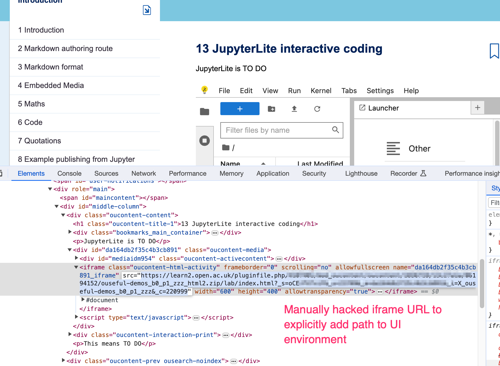

# JupyterLite interactive coding

JupyterLite provides an in-browser JupyterLab environment capabale of executing code within the browser using WASM based code execution environments for JavaScript, Python and R.

```{ou-html5} resources/jupyterlite.zip
:width: 140
```

This doesn't quite work yet; if we hackl the iframe source and change the path `index.html` to `lab/indexhtml` it will work (although currently there are no code execution kernels installed).)



JupyterLite also supports a notebook view and a console. which opens up various interesting possibilities. There is also an extension that allows files to be opened into JupyterLab from the desktop when using the Chrome browser, although this extension is not currently installed.